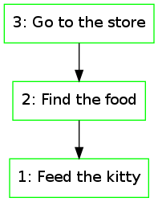

# clokado

A small Clojure library designed to implement [Mikado Method](http://mikadomethod.wordpress.com/) abstractions.

## Mikado Method

It's simple yet useful method for large-scale software refactoring. But you also can use it for other purposes. Please refer to the original site for more information.

## Usage

This library is in Alpha state, and general usage patterns are not clearly defined yet. But what do we have for now:

 * you can use functions `mikado`, `add`, `close` to create new goals and close existing ones
 * you can use `delete` function to remove unneeded goals
 * you can use functions `link` and `unlink` to create and remove links between goals
 * you can use `top` function over your goal tree to see what active goals do you have
 * you can visualize your tree with functions in `clokado.graphviz` package (also you have to install [GraphViz](http://graphviz.org/))

## REPL usage example

I suppose that in most cases you need to work with one diagram at once. In that way the following workflow may be found as the simplest one:

    (use 'clokado.global)
    (mikado! "Feed the kitty" "example")

Here "Feed the kitty" is your Mikado Goal, and "example" is the name of diagram to be drawn (actually, it's "example.png").

You can launch your preffered image viewer to find that image "example.png" has appeared in the directory you've been launched REPL. Please enable auto-refresh and go on with diagram hacking:

    (add! "Find the food")
    (add! "Go to the store" 1)

Here, 1 is the id of the second goal, and it can be easily recognized from the picture. When you don't append id as the parameter, the new goal is being attached to Mikado goal. Also you can see that picture is being updated after every your action.

    (close! 2)

When you finish the current goal, close it with `close!` function. Its color immediately changes.

What we've got in result:

When you've got tired of current goal tree (or better complete it), just start new one with `mikado!` function.

## Further plans

I just want to use it for some time and determine what else should be done. Maybe, something like that:

 * some helper functions that make usage in REPL a bit easier and faster
 * single-page web app based on these functions (I'll take a look at ClojureScript)
 * something else

## License

Copyright © 2013-2014 Andrey Hitrin

Distributed under the Eclipse Public License, the same as Clojure.
