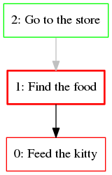

# clokado

A small Clojure library designed to implement [Mikado Method](http://mikadomethod.wordpress.com/) abstractions.

## Mikado Method

It's simple yet useful method for large-scale software refactoring. But you also can use it for other purposes. Please refer to the original site for more information.

## Usage

This library is in Alpha state, and general usage patterns are not clearly defined yet. But what do we have for now:

 * you can use functions `mikado`, `add`, `close` to create new goals and close existing ones
 * you can use `top` function over your goal tree to see what active goals do you have
 * you can visualize your tree with functions in `clokado.graphviz` package (also you have to install [GraphViz](http://graphviz.org/))

A simple visualization example:

(Almost) obviously that goal number 1 is your Mikado goal, and other goals block it.

## To be implemented in version 0.2.0

clokado.core:

 * completely remove existing goals
 * add or remove links between existing goals
 * checks for corner cases

clokado.graphviz:

 * call graphviz to create picture
 * fix colors (green for done goals, red for undone)

clokado.global:

 * create new module
 * define one global dynamic variable that is used as default mikado tree
 * implement wrapper functions that call functions from `clokado.core` upon this variable
 * **MOTIVATION**: simplify work with mikado in REPL

## Further plans

I just want to use it for some time and determine what else should be done. Maybe, something like that:

 * some helper functions that make usage in REPL a bit easier and faster
 * single-page web app based on these functions (I'll take a look at ClojureScript)
 * something else

## License

Copyright © 2013 Andrey Hitrin

Distributed under the Eclipse Public License, the same as Clojure.
